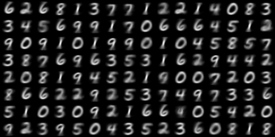
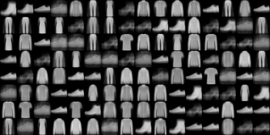
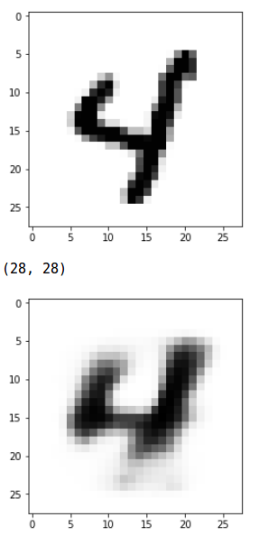
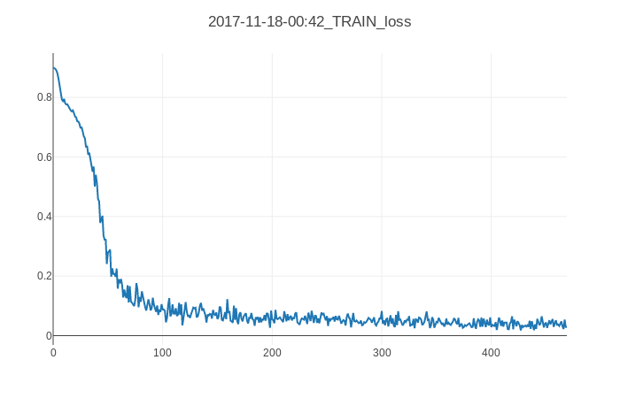
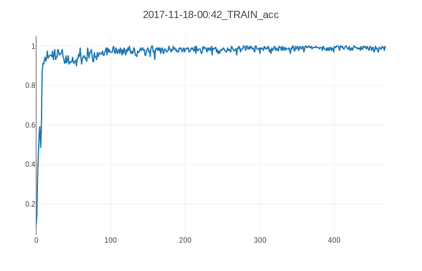
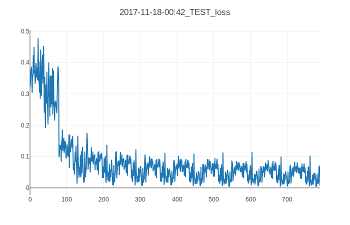
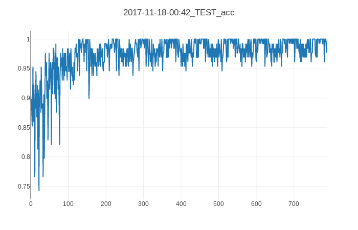
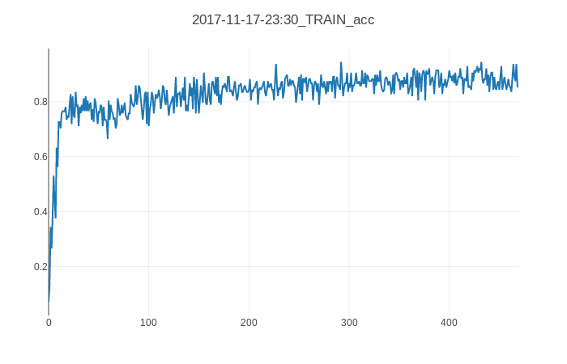
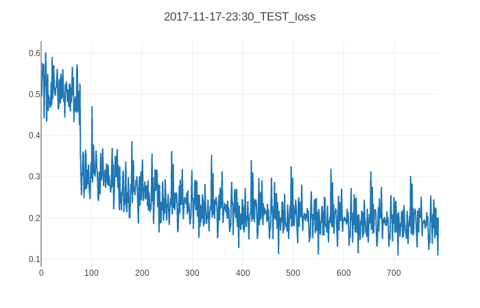
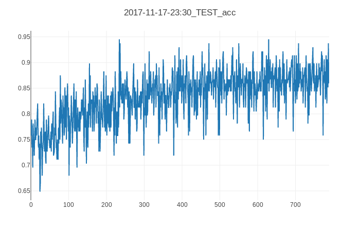

# 💊 CapsuleNet 💊

A PyTorch implementation of CapsuleNet as described in ["Dynamic Routing Between Capsules"](https://arxiv.org/abs/1710.09829) by Hinton et al.

Includes decoder and pretrained weights for MNIST and Fashion MNIST in `checkpoints/`.

## Instructions

This project uses conda for package management, install miniconda3 [here](https://conda.io/miniconda.html).

Create an environment with all the dependancies:

```
conda env create -f environment.yml
```

Activate with

```
source activate capsnet
```

To train:

```
▶ python train.py --help
usage: CapsNet [-h] [--epochs EPOCHS] [--data_path DATA_PATH]
               [--batch_size BATCH_SIZE] [--use_gpu] [--lr LR]
               [--log_interval LOG_INTERVAL] [--visdom] [--dataset DATASET]
               [--load_checkpoint LOAD_CHECKPOINT]
               [--checkpoint_interval CHECKPOINT_INTERVAL]
               [--checkpoint_dir CHECKPOINT_DIR] [--gen_dir GEN_DIR]

Example of CapsNet

optional arguments:
  -h, --help            show this help message and exit
  --epochs EPOCHS
  --data_path DATA_PATH
  --batch_size BATCH_SIZE
  --use_gpu
  --lr LR               ADAM learning rate (0.01)
  --log_interval LOG_INTERVAL
                        number of batches between logging
  --visdom              Whether or not to use visdom for plotting progrss
  --dataset DATASET     The dataset to train on, currently supported: MNIST,
                        Fashion MNIST
  --load_checkpoint LOAD_CHECKPOINT
                        path to load a previously trained model from
  --checkpoint_interval CHECKPOINT_INTERVAL
                        path to load a previously trained model from
  --checkpoint_dir CHECKPOINT_DIR
                        dir to store checkpoints in
  --gen_dir GEN_DIR     folder to store generated images in
(ml)
```

```
python train.py --visdom --checkpoint_interval=1 --epochs=10
```

### Visdom for graphing progress

To start the visdom server:

```
python -m visdom.server
# Now running on http://localhost:8097/
```

Then run with the `--visdom` flag


### To run using Fashion mnist

Download the dataset from [here](https://github.com/zalandoresearch/fashion-mnist), place them in a subdirectory of folder entitled raw and run with

```
python train.py --data_path=<path to download> ...
```

your fashion-mnist folder should look like this

```
▶ tree ~/data/fashion-mnist
/home/erikreppel/data/fashion-mnist
├── processed
│   ├── test.pt
│   └── training.pt
└── raw
    ├── t10k-images-idx3-ubyte
    ├── t10k-labels-idx1-ubyte
    ├── train-images-idx3-ubyte
    └── train-labels-idx1-ubyte

2 directories, 6 files

```
The `processed` folder is created after training starts.

The PyTorch mnist dataset class will handle pre-processing.

## Results

| Dataset       | Epochs | Test loss | Test accuracy |
| ------------- | ------ |---------- | ------------- |
| MNIST         | 10     | 0.04356   | 98.803        |
| Fashion MNIST | 10     | 0.19429   | 86.580        |
| MNIST         | 50     | 0.03029   | 99.011        |
| Fashion MNIST | 50     | 0.16416   | 88.904        |


Using:

```
Conv layer:
- input channels: 1
- output channels: 256
- stride: 1
- kernel size: 9x9

Capsule layer 1:
- 8 capsules of size 1152
- input channels: 256
- output channels: 32

Capsule layer 2:
- 10 capsules of size 16 (10 classes in mnist)
- input channels: 32
- 3 iterations of the routing algorithm
```

### Generated images

I have yet to be able to reproduce the sharpness of reproduced images from the paper,
I suspect it the reason is because I am decoupling the digit cap results from so
that loss from the image generation is not backproped into capsnet. 

####  Results of the decoder:




Comparison of original and generated:



## Training Graphs

Results of training for 10 epochs on MNIST:






Results of training for 10 epochs on Fashion MNIST:







## References

I found these implementations useful when I got stuck

- https://github.com/llSourcell/capsule_networks
- https://github.com/cedrickchee/capsule-net-pytorch
