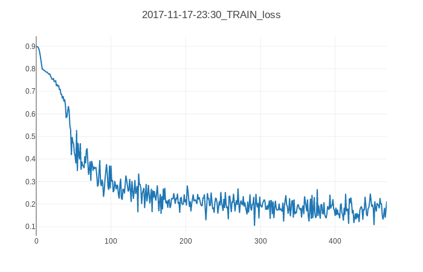

# 💊 CapsuleNet 💊

A PyTorch implementation of CapsuleNet as described in ["Dynamic Routing Between Capsules"](https://arxiv.org/abs/1710.09829) by Hinton et al.

## Results

| Dataset       | Test loss | Test accuracy |
| ------------- |---------- | ------------- |
| MNIST         | 0.04356   | 98.803        |
| Fashion MNIST | 0.19429   | 86.580        |

Using:

```
Conv layer:
- input channels: 1
- output channels: 256
- stride: 1
- kernel size: 9x9

Capsule layer 1:
- 8 capsules of size 1152
- input channels: 256
- output channels: 32

Capsule layer 2:
- 10 capsules of size 16 (10 classes in mnist)
- input channels: 32
- 3 iterations of the routing algorithm
```

Results of training for 10 epochs on MNIST:


Results of training for 10 epochs on Fashion MNIST:




## References

I found these implementations useful when I got stuck

- https://github.com/llSourcell/capsule_networks
- https://github.com/cedrickchee/capsule-net-pytorch
